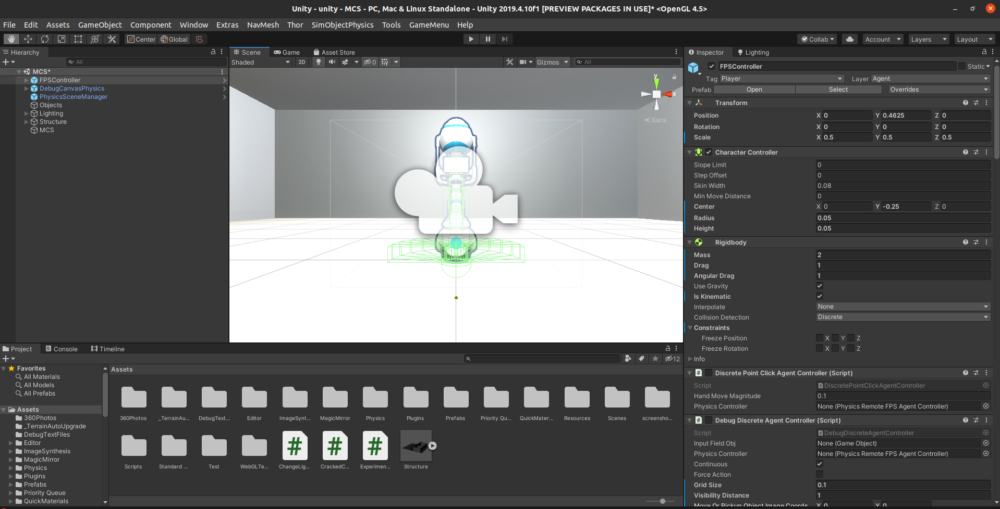
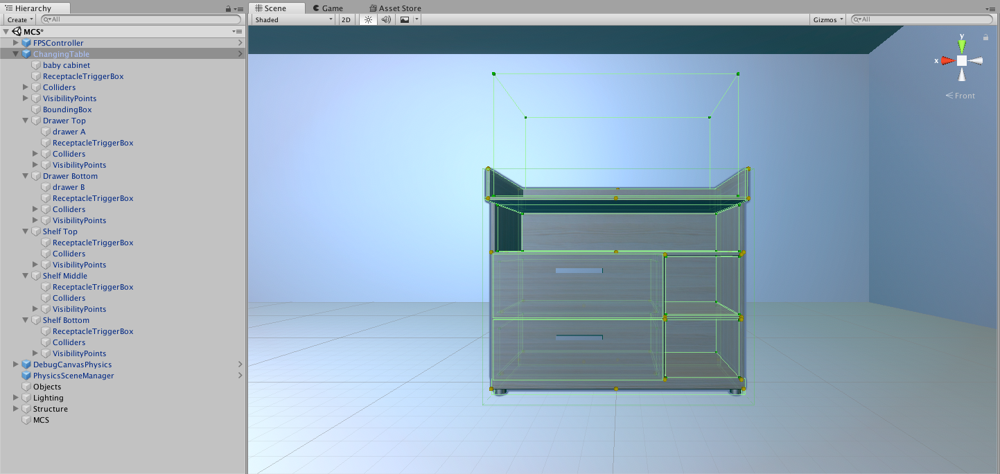

Adding 3D Models
================

Here are the steps to add your own 3D models into the MCS simulation environment. Each step is described in more detail below.

1. Download and open our Unity project (MCS fork of AI2-THOR) in the Unity Editor
2. Import your 3D models into our Unity project as Unity Prefab objects
3. Update your Unity Prefab objects with the correct AI2-THOR Unity scripts and subcomponents to work properly in the simulation environment
4. Update the MCS object registry file with references to your new objects
5. Manually test and verify that interaction with your new objects works as expected
6. Build a new version of the Unity project containing your additions
7. Update the Scene Generator with properties for your new objects
8. Optionally, submit a Pull Request to contribute your new objects to our public project

Limitations
-----------

- Currently, our simulation environment does not support soft-body physics objects like blankets or stuffed animals.
- We have not tried using animations, audio, or fluids yet, so we cannot guarantee their performance.
- Successfully integrating existing objects that are part of the original AI2-THOR project but not yet available in the MCS simulation environment may necessitate making MCS-specific adjustments to those objects.
- This is a manually-intensive procedure that requires using the Unity Editor. Since human perception is needed for indentifying the correct pixels to position bounding boxes around and/or inside specific parts of the 3D model, we're not currently planning on making this procedure automated or dynamic. This is exactly how the MCS Core Team adds models into the simulation environment -- we have no secret shortcuts here.

1. Download and Open MCS in the Unity Editor
--------------------------------------------

Clone the `MCS fork of AI2-THOR <https://github.com/NextCenturyCorporation/ai2thor>`_ and follow the project's `setup instructions <https://github.com/NextCenturyCorporation/ai2thor#setup>`_ to download and install the correct version of the Unity Editor and use it to load the MCS Unity project.

2. Import Your Models into Unity and Save Them as Prefabs
---------------------------------------------------------

2A. Copy your 3D model into the `/unity/Assets/Resources/MCS/` folder (you can make a new subfolder for your models if you prefer).

2B. Navigate to the folder containing your model using the Project window of the Unity Editor. You should see your model there as a thumbnail.

2C. Click and drag your model's thumbnail into the Scene window. Your model should appear in the empty scene, and the name of your model's name should appear in the list in the Hierarchy window.

2D. Click and drag your model's name from the list in the Hierarchy window into your folder in the Project window. You should see a "Create Prefab" popup appear. Click the "Original Prefab" button to create a Unity Prefab file (".prefab") for your model. Please see the Unity Manual for more information about Prefabs.

3. Update Your Prefabs in Unity
-------------------------------

3A. In the Hierarchy window, your model's name in the list is an instantiation of the Prefab, called a Game Object. Next to the Game Object, click the right arrow (`>`) on the right side of the list to edit the Prefab. This will change the Scene window to show a Prefab editing view. The Hierarchy window will now show just the Game Object. Depending on how your model was made, it may have one or more child Game Objects, shown as a nested view. Objects with multiple interactable parts (like, cabinet doors, drawers, and shelves) should have a child for each part. We'll call the parent Game Object the Target. In the Hierarchy window, click on the Target and look at the Inspector window to verify that it has a MeshFilter, MeshRenderer, and material(s); if it doesn't, then one of its children should have them (click on each child in turn).

.. video:: tutorial/adding_3d_models_tutorial_step_3a.mp4
   :width: 750
   :height: 450

3B. Ideally, the Target should always be centered on the X/Z axis. First, in the Hierarchy window, click on the Target; then, in the Inspector window, in the Transform Component, zero out its Position. If the Target still isn't centered, then the 3D model itself may be off-center: adjust the Position in the Target's Transform Component to visually center the object on the X/Z axis. Failing to do this may cause the Scene Generator to generate buggy scenes containing clipping objects. The model's Y position can be any value, but normally it's either centered on the Y axis, or moved upward so that a position of Y=0 lets the object sit on the ground without clipping it. Take note of the Y position for step 7 later.

.. video:: tutorial/adding_3d_models_tutorial_step_3b.mp4
   :width: 750
   :height: 450

3C. Click on the Target. In the Inspector window, set the Tag to "SimObjPhysics" and the Layer to "SimObjVisible". Click on the Add Component button to add a Rigidbody Component to the Target. Ensure its "Use Gravity" is set to true.

.. video:: tutorial/adding_3d_models_tutorial_step_3c.mp4
   :width: 750
   :height: 450

3D. In the Inspector window, review the Target's existing Unity Components (the separate dropdown sections). If the Target (or any of its children) doesn't have a Collider Component, you'll have to add some. Please see the Unity Manual for more information about Colliders.

- In the Hierarchy window, right-click on the Target and create an Empty Child.
- In the Inspector window, rename it to "Colliders" and mark it Static.
- Right-click on the "Colliders" Game Object and create an Empty Child for each Collider you need to have.
- On each "Colliders" child, in the Inspector window:
  - Rename it to a useful name.
  - Add a Collider Component (normally a box, but sometimes others -- note that all MeshColliders should be CONVEX).
  - Adjust the Transform Component and/or Collider Component to visually position, rotate, and scale the Collider to the appropriate pixels.
  - Set the Tag to "SimObjPhysics" and the Layer to "SimObjVisible".

.. video:: tutorial/adding_3d_models_tutorial_step_3d.mp4
   :width: 750
   :height: 450

3E. Next you must add "Visibility Points" along the visible pixel boundaries of your model. AI2-THOR raycasts from the performer agent to an object's Visibility Points in order to determine if the object is visible (and can be an action target). The greater number of Visibility Points, the more accurate the visibility readings will be. Our suggestion is to position one Visibility Point at each of the object's corners, plus one or more in a grid along each of the object's 6 sides.

- In the Hierarchy window, right-click on the Target and create an Empty Child.
- In the Inspector window, rename it to "VisibilityPoints" (no space!) and mark it Static.
- Right-click on the "VisibilityPoints" Game Object and create an Empty Child for each Visibility Point you want to have.
- On each Visibility Point Game Object, in the Inspector window:
  - Adjust the Transform Component to visually position the Visibility Point to the appropriate pixels. (To see the Visibility Point's position in the Scene window, you can set a colored Icon on the Visibility Point Game Object using the cube button in the top-left corner of the Inspector window.)
  - Set the Layer to "SimObjVisible".

.. video:: tutorial/adding_3d_models_tutorial_step_3e.mp4
   :width: 750
   :height: 450

3F. Next you must add a single "Bounding Box" containing the whole 3D model. You cannot reuse an existing Collider for this.

- In the Hierarchy window, right-click on the Target and create an Empty Child.
- In the Inspector window, rename it to "BoundingBox" (no space!) and set its Layer to "SimObjInvisible".
- Click on the Add Component button to add a BoxCollider Component.
- In the BoxCollider Component, click the checkbox to mark it as NOT ACTIVE.
- Adjust the Transform Component (but not the BoxCollider Component -- adjusting both makes it harder on us later) to visually position, rotate, and scale the Collider to the appropriate pixels completely enclosing the model. Take note of the position, rotation, and scale for step 7 later.

.. video:: tutorial/adding_3d_models_tutorial_step_3f.mp4
   :width: 750
   :height: 450

3G. Next you must add a SimObjPhysics Component to the Target. This AI2-THOR Script enables interaction with the object.

- In the Hierarchy window, click on the Target.
- In the Inspector window, click on the Add Component button to add a SimObjPhysics Component.
- In the SimObjPhysics (Script) Component:
  - Set the "Primary Property" to "Static" (for non-moveable objects), "Moveable", or "Can Pickup" (a subset of Moveable).
  - Set the "Secondary Properties" as needed (we use: "Receptacle" for objects on which you can use the PutObject action; "Can Open" for openable objects; "Stacking" for blocks). You will need to adjust the size of the "Secondary Properties" array before you can add new elements to it.
  - Set the "Bounding Box" property to the "BoundingBox" Game Object that you made.
  - Set the "Visibility Points" array property to have each Visibility Point Game Object that you made. This is easy if you right-click on the Inspector tab, click "Lock", go to the Hierarcy window, use click-shift-click to select all Visibility Points simultaneously, and click-and-drag them over from the Hierarchy window onto the "Visibility Points" label in the SimObjPhysics (Script) Component.
  - Set the "My Colliders" array property to have each Collider Game Object that you made.
  - Optionally, set the "Salient Materials" property as needed.

.. video:: tutorial/adding_3d_models_tutorial_step_3g.mp4
   :width: 750
   :height: 450

3H. If the Target is openable, like a cabinet or drawer, you must add a "Can Open_Object" Component to the Target. This AI2-THOR Script enables opening and closing the object and adjusting its visual appearance.

- In the Hierarchy window, click on the Target.
- In the Inspector window, click on the Add Component button to add a "Can Open_Object" Component.
- In the "Can Open_Object" (Script) Component:
  - Set the "Moving Parts" property to the Target.
  - Adjust the "Open Positions" and "Close Positions" to visually position, rotate, or scale the model to the approriate pixels for its "opened" and "closed" positions respectfully. Change the "Movement Type" property to "Slide", "Rotate", or "Scale" as needed, depending on how the model should change when it's opened.

.. video:: tutorial/adding_3d_models_tutorial_step_3h.mp4
   :width: 750
   :height: 450

3I. If the Target is a Receptacle (you want to enable the use of the PutObject action to place held objects on top of your Target):

- In the Hierarchy window, right-click on the Target and create an Empty Child.
- In the Inspector window, rename it to "ReceptacleTriggerBox" (no space!) and mark it Static.
- Set the Tag to "Receptacle" and the Layer to "SimObjInvisible".
- Click on the Add Component button to add a BoxCollider Component.
- In the BoxCollider Component, set the "Is Trigger" property to true.
- Adjust the Transform Component (but not the BoxCollider Component -- adjusting both makes it harder on us later) to visually position, rotate, and scale the Collider to the appropriate pixels completely enclosing the receptacle area on which held objects may be placed. (I'm not sure if the height actually matters).  Take note of the position, rotation, and scale for step 7 later.
- Click on the Add Component button to add a Contains Component.

.. video:: tutorial/adding_3d_models_tutorial_step_3i.mp4
   :width: 750
   :height: 450

3J. For each distinct interactable part within the Target (like cabinet doors, drawers, and shelves):

- Right-click on the Target and create an Empty Child (we'll call this the Sub-Target).
- Rename the Sub-Target to a useful name.
- In the Hierarchy window, click-and-drag to move the Game Object containing the MeshFilter and MeshRenderer Components corresponding to the Sub-Target under the Sub-Target.
- Repeat steps 3C-3J (EXCEPT 3F) on the Sub-Target.

.. video:: tutorial/adding_3d_models_tutorial_step_3j.mp4
   :width: 750
   :height: 450

3K. In the Hierarchy window, click the left arrow (`<`) in the top-left corner to save your Prefab and exit the editing view.

4. Update the Object Registry File
----------------------------------

.. video:: tutorial/adding_3d_models_tutorial_step_4.mp4
   :width: 750
   :height: 450

In the MCS fork of AI2-THOR, in `/unity/Assets/Resources/MCS/mcs_object_registry.json`, add a new entry for your object that contains the following properties:

- `id` (string): Your object's unique ID which will correspond to the `type` property in MCS JSON scene files. Please ensure that you don't use an ID/type that's already taken (see our :doc:`SCHEMA doc <schema>` for the full list).
- `interactables` (dict array): If your object has distinct interactable parts (see section 3J), list each one as a dict in this array. Each dict should have a string `id` property for the part's unique object ID (for the object ID action parameters) and a string `name` property for a human-readable name.
- `materials` (string array): The names of all the default Unity materials on your Prefab (like "BrownWood" or "Grey Metal"). Needed if your Prefab has multiple default Unity materials.
- `resourceFile` (string): The path to your object's Prefab file, starting in the `/unity/Assets/Resources/MCS/` folder, and WITHOUT the `.prefab` extension. Examples:
  - If your Prefab file is `/unity/Assets/Resources/MCS/thing.prefab`, your `resourceFile` property should be `thing`
  - If your Prefab file is `/unity/Assets/Resources/MCS/subfolder/thing.prefab`, your `resourceFile` property should be `subfolder/thing`
- `shape` (string): The object's human-readable shape that's returned in the Python output metadata.

You can also add other properties to entries in the JSON object registry file. Most object properties supported in scene files (like `moveable`, `pickupable`, `receptacle`, or `openable`) are also supported in the object registry. Any properties defined for an object in the object registry file are applied to all instances of that object in all scenes. Please let us know if you'd like us to make some documentation on the available properties.

Example:

.. code-block:: json

  {
      "id": "ball",
      "resourceFile": "UnityAssetStore/Kindergarten_Interior/Prefabs/Ball 1",
      "mass": 1,
      "pickupable": true,
      "shape": "ball"
  }

5. Manually Test and Verify Your Objects
----------------------------------------

.. video:: tutorial/adding_3d_models_tutorial_step_5.mp4
   :width: 750
   :height: 450

Create one or more MCS JSON scene files in the `/unity/Assets/Resources/MCS/Scenes/` folder containing your new object(s). Follow the `run instructions <https://github.com/NextCenturyCorporation/ai2thor#run>`_ to run your scenes in the Unity Editor and verify your new objects work as expected. Good behavior to test (and remember to test your actions using both the object IDs and the image pixel coordinates!):

- Moving into and around your object
- Picking up your object
- Dropping your object
- Placing your object onto/into a receptacle (with the PutObject action)
- If your object is a receptacle: Placing another object onto/into your object
- If your object is a container (a.k.a. an openable receptacle): Opening and closing your object
- If needed, using relevant actions on your object's interactable parts (like cabinet doors, drawers, and shelves)
- Scaling your object in multiple dimensions
- Adding Unity Materials (colors/textures) to your object
- Interacting with your object from the side, rear, and other angles/viewpoints

6. Build Unity
--------------

Inside the Unity Editor, go to `File->Build Settings` to open the Build Settings popup window, then build the project by selecting your Target Platform and clicking the Build button.

7. Update the Scene Generator
-----------------------------

.. video:: tutorial/adding_3d_models_tutorial_step_7.mp4
   :width: 750
   :height: 450

If you want to have your new objects appear in the random scenes made by our `Scene Generator <https://github.com/NextCenturyCorporation/mcs-scene-generator>`_, you must add some information about each object (which we call an "object definition") into the Scene Generator's source code.

For adding new objects into passive agent scenes, please skip to step 7D.

7A. Open the relevant object definition file:

- For gravity support scenes, use the `gravity_support_objects.py <https://github.com/NextCenturyCorporation/mcs-scene-generator/blob/master/gravity_support_objects.py>`_ file.
- For other passive scenes, and all interactive scenes, use the `objects.py <https://github.com/NextCenturyCorporation/mcs-scene-generator/blob/master/objects.py>`_ file.

7B. Create a new dict, give it a useful name starting with an underscore, and add the following properties:

- `type` (string, required): The ID of your object, from the object registry file.
- `attributes` (string array): Any attributes that you always want added to your object, like `moveable`, `pickupable`, `receptacle`, or `openable`. (This will be redundant if you already added these properties to the object's entry in the object registry file -- see step 4.) If you want to use your object as an obstacle or occluder (for interactive obstacle or occluder scenes), add `obstacle` and/or `occluder` to this array.
- `color` (string): The color of your object, as a human-readable string. Not needed if using the `materialCategory` property.
- `dimensions` (dict with `x`, `y`, and `z` float properties): The visual dimensions of your model's bounding box as noted in step 3F.
- `enclosedAreas` (array of dicts with string `id`, dict `position`, and dict `dimensions` properties; `position` and `dimensions` each have `x`, `y`, and `z` float properties): The enclosed areas of your object, if it's a container or has openable parts (like cabinets or drawers). If the enclosed area is part of the object itself (it's opened using the object's ID), then the `id` can be set to an empty string. If the enclosed area is a distinct interactable part of your object (as listed in the `interactables` property of the object registry file -- see step 4), then the `id` should be set to the same `id` listed in the corresponding `interactables` property. The `position` and `dimensions` should correspond to the `position` and `scale` noted in step 3I.
- `mass` (float): The mass of your object.
- `materials` (string array): If you want to assign a specific Unity material (color/texture) to your object, add a string here for the material path you want to use. See the `Material List <https://github.com/NextCenturyCorporation/MCS/blob/master/machine_common_sense/scenes/SCHEMA.md#material-list>`_ in our SCHEMA doc for the full list.
- `materialCategory` (string array): If you want to assign a random Unity material (color/texture) to your object, add a string here for the material category you want to use. The material lists are in the `materials.py <https://github.com/NextCenturyCorporation/mcs-scene-generator/blob/master/materials.py>`_ file. If your object has multiple default Unity materials (as listed in the `materials` property of the object registry file -- see step 4), you can have more than one material category strings in this array, and each will map to the corresponding index in the `materials` property. If you want to have multiple material category options, please nest them in separate dicts within a `chooseMaterial` array property.
- `positionY` (float): The starting Y position that should always be assigned to your object (unless it's on/in a receptacle). This will depend on how your model is positioned on the Y axis in its Prefab as noted in step 3B. If a position of Y=0 lets the object sit on the ground without clipping it, then your positionY should be 0. Otherwise, adjust your postionY to a positive number that lets the object sit on the ground without clipping it.
- `scale` (dict with `x`, `y`, and `z` float properties): The scale you want applied to your object. The default scale of your object's Prefab is multiplied by these values. If you want to have multiple scale options, please nest them in separate dicts within a `chooseSize` array property.
- `shape` (string or string array): The shape of your object, as a human-readable string.
- `size` (string): The size of your object, as a human-readable string. See the :mod:`GoalMetadata <machine_common_sense.GoalMetadata>` entry in our API doc for the sizes that our team uses.

Example Object Definition:

.. code-block:: json

    {
        "type": "ball",
        "attributes": ["moveable", "pickupable"],
        "dimensions": {
            "x": 0.5,
            "y": 0.5,
            "z": 0.5
        },
        "mass": 0.5,
        "materialCategory": ["rubber"],
        "positionY": 0.25,
        "scale": {
            "x": 0.5,
            "y": 0.5,
            "z": 0.5
        },
        "shape": ["ball"],
        "size": "small"
    }

7C. Add your new object definitions to the relevant arrays of available objects:

- For all interactive scenes, in `objects.py`, see the `_PICKUPABLES`, `_NOT_PICKUPABLES`, and `_CONTAINERS` variables, which are each arrays of arrays of object definitions. When an object definition is randomly chosen from one of these lists (for example, a "not pickupable" object), we first randomly choose one of the inner arrays, then we randomly choose one of the object definitions from the inner array. Add your object definition either as a new inner array or to an existing inner array.
- For gravity support scenes, in `gravity_support_objects.py`, see the `_ASYMMETRIC_TARGET_LIST` and `_SYMMETRIC_TARGET_LIST` variables, which are each arrays of object definitions. Add your object definition to one of these arrays.
- For other passive scenes, in `objects.py`, see the `_MOVE_ACROSS_COMPLEX` and `_FALL_DOWN_COMPLEX` variables, which are each arrays of object definitions. Add your object definition to either one or both of these arrays.

7D. To add new objects into passive agent scenes, in `agent_scene_pair_json_converter.py <https://github.com/NextCenturyCorporation/mcs-scene-generator/blob/master/agent_scene_pair_json_converter.py>`_, see the `AGENT_OBJECT_CONFIG_LIST` and `GOAL_OBJECT_CONFIG_LIST` variables. Add a new ObjectConfig to either one or both of the two arrays, as needed.

8. Submit a Pull Request
------------------------

Optionally, if you would like to contribute your objects to the public MCS simulation environment (in our GitHub source code repository) for other teams to use, and have legal permission to share your models, then you may submit a Pull Request to the MCS fork of AI2-THOR containing your new Prefabs and updates to the object registry file.

Troubleshooting
---------------

If you have any questions about the procedure, please contact the MCS Core Team by opening a new GitHub Issue on this repository, posting on the #ta2-api MCS Slack channel, or emailing: mcs-ta2@machinecommonsense.com

We're happy to provide clarification on these instructions, but we can't guarantee that we'll always have time to help you in executing these instructions.
