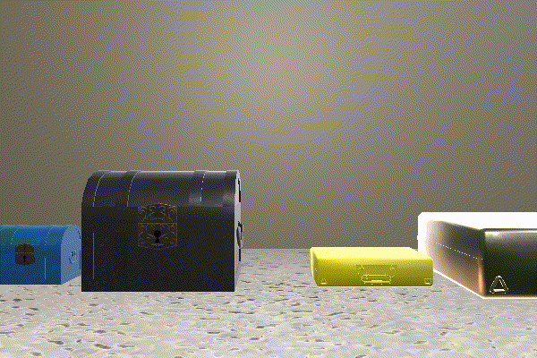
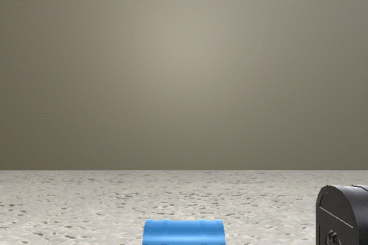

# MCS Scene Configuration Files

Documentation: [SCHEMA.md](./SCHEMA.md)

## Interactive Scenes

### Playroom

An open room containing over 40 objects for undirected exploration.

- [playroom.json](./playroom.json)

### Retrieval Goal

Soccer ball retrieval goal for the Summer 2021 evaluation:

- [retrieval_goal_example_with_soccer_ball.json](./retrieval_goal_example_with_soccer_ball.json)

Silver trophy retrieval goal for the Winter 2020 evaluation:

- [retrieval_goal_example_with_trophy.json](./retrieval_goal_example_with_trophy.json)

### Hinged Containers

Soccer ball inside hinged containers for the Summer 2021 evaluation:

- [hinged_container_example_with_soccer_ball.json](./hinged_container_example_with_soccer_ball.json)

Silver trophy inside hinged containers for the Winter 2020 evaluation:

- [hinged_container_example_with_trophy.json](./hinged_container_example_with_trophy.json)

### Interactive Object Permanence and Reorientation Tasks

The room has different dimensions/bounds, and isn't necessarily square. Previously, the room's dimensions were always [-5, 5] on both the X and the Z axes.

- [template_12_by_8.json](./template_12_by_8.json)
- [template_2_by_4.json](./template_2_by_4.json)

| | |
| --------- | ----------- |
|  |  |

The room's outer walls are individually, distinctly colored. Previously, all of the room's outer walls were always the same color.

- [template_individually_colored_walls.json](./template_individually_colored_walls.json)

| |
| --------- |
|  |

The performer agent is positioned on top of a flat, raised platform. Moving off the edge of the platform will cause the performer agent to automatically, instantaneously fall down to the floor, and the performer agent will not be able to move back on top of the platform.

- [template_platform_independent.json](./template_platform_independent.json)
- [template_platform_bisecting.json](./template_platform_bisecting.json)

| | |
| --------- | ----------- |
|  |  |

The performer agent is temporarily "frozen" (can only use the Pass action) at the start and/or in the middle of an interactive scene. This is done by the same method that is used for the passive/VoE scenes (see the StepMetadata.action_list property).

- [template_frozen_first_10_steps.json](./template_frozen_first_10_steps.json)
- [template_frozen_after_10_steps.json](./template_frozen_after_10_steps.json)

| | |
| --------- | ----------- |
|  |  |

A cylindrical mechanism attached to a wall or the ceiling throws (for interactive object permanence) or drops (for reorientation) the target object (i.e. soccer ball) into the scene.

- [template_mechanism_dropping_soccer_ball.json](./template_mechanism_dropping_soccer_ball.json)
- [template_mechanism_throwing_soccer_ball.json](./template_mechanism_throwing_soccer_ball.json)

| | |
| --------- | ----------- |
|  |  |

The performer agent is "kidnapped" (can only call the EndHabituation action) and teleported to another position in the current room one or more times. Prior to being kidnapped, the performer agent is able to move around and explore its environment for a limited number of steps. On the kidnapped step, the returned images will be black. Prior to the final kidnapping, StepMetadata.habituation_trial will be an integer; after the final kidnapping, StepMetadata.habituation_trial will be "None" to denote the test trial.

- [template_kidnapping.json](./template_kidnapping.json)
- [template_kidnapping_then_frozen.json](./template_kidnapping_then_frozen.json)

| | |
| --------- | ----------- |
|  |  |

Combination of multiple elements. For example: a platform, being frozen, and a mechanism throwing the soccer ball into the scene.

- [template_interactive_object_permanence_scene.json](./template_interactive_object_permanence_scene.json)

| |
| --------- |
|  |

## Intuitive Physics Scenes

### Gravity Support: Objects Falling Down

All of these examples are PLAUSIBLE

- [gravity_support_ex_01.json](./gravity_support_ex_01.json)
- [gravity_support_ex_02.json](./gravity_support_ex_02.json)
- [gravity_support_ex_03.json](./gravity_support_ex_03.json)
- [gravity_support_ex_04.json](./gravity_support_ex_04.json)
- [gravity_support_ex_05.json](./gravity_support_ex_05.json)
- [gravity_support_ex_06.json](./gravity_support_ex_06.json)
- [gravity_support_ex_07.json](./gravity_support_ex_07.json)
- [gravity_support_ex_08.json](./gravity_support_ex_08.json)
- [gravity_support_ex_09.json](./gravity_support_ex_09.json)
- [gravity_support_ex_10.json](./gravity_support_ex_10.json)
- [gravity_support_ex_11.json](./gravity_support_ex_11.json)
- [gravity_support_ex_12.json](./gravity_support_ex_12.json)

| | |
| --------- | ----------- |
|  |  |
|  |  |
|  |  |
|  |  |
|  |  |
|  |  |

### Object Permanence and Spatio-Temporal Continuity: Objects Moving on Multiple Axes Behind Occluders

Relevant for the Summer 2021 evaluation. Objects may move on only the X axis (as in previous evaluations), on both the X and Z axes (see the "move deep" example scenes), and/or on both the X and Y axes (see the "move toss" example scenes).

- [move_deep_fast_01.json](./move_deep_fast_01.json)
- [move_deep_fast_02.json](./move_deep_fast_02.json)
- [move_deep_fast_03.json](./move_deep_fast_03.json)
- [move_deep_fast_04.json](./move_deep_fast_04.json)
- [move_toss_fast_01.json](./move_toss_fast_01.json)
- [move_toss_fast_02.json](./move_toss_fast_02.json)

| | |
| --------- | ----------- |
|  |  |
|  |  |
|  |  |

### Object Permanence: Objects Moving on Multiple Axes and Stopping Behind Occluders

Relevant for the Summer 2021 evaluation. Objects may move across the entire screen and exit on the other side (as in previous evaluations), or come to a natural stop behind the occluder. Objects may move on only the X axis (as in previous evaluations), on both the X and Z axes (see the "move deep" example scenes), and/or on both the X and Y axes (see the "move toss" example scenes).

- [move_slow_01.json](./move_slow_01.json)
- [move_deep_slow_01.json](./move_deep_slow_01.json)
- [move_toss_slow_01.json](./move_toss_slow_01.json)
- [move_slow_02.json](./move_slow_02.json)
- [move_deep_slow_02.json](./move_deep_slow_02.json)
- [move_toss_slow_02.json](./move_toss_slow_02.json)

| Example 1 | Example 2 |
| --------- | ----------- |
|  |  |
|  |  |
|  |  |

### Object Permanence: Objects Falling Down Behind Occluders

Relevant for the Winter 2020 evaluation.

- [object_permanence_plausible.json](./object_permanence_plausible.json)
- [object_permanence_implausible.json](./object_permanence_implausible.json)

| Plausible | Implausible |
| --------- | ----------- |
|  |  |

### Shape Constancy: Objects Falling Down Behind Occluders

Relevant for the Winter 2020 and Summer 2021 evaluations

- [shape_constancy_plausible.json](./shape_constancy_plausible.json)
- [shape_constancy_implausible.json](./shape_constancy_implausible.json)

| Plausible | Implausible |
| --------- | ----------- |
|  |  |

### Spatio-Temporal Continuity: Objects Moving Across Behind Occluders

Relevant for the Winter 2020 evaluation.

- [spatio_temporal_continuity_plausible.json](./spatio_temporal_continuity_plausible.json)
- [spatio_temporal_continuity_implausible.json](./spatio_temporal_continuity_implausible.json)

| Plausible | Implausible |
| --------- | ----------- |
|  |  |

## Agents Scenes

### Agents Have Goals and Preferences

- [agents_preference_expected.json](./agents_preference_expected.json)
- [agents_preference_unexpected.json](./agents_preference_unexpected.json)

| Plausible | Implausible |
| --------- | ----------- |
|  |  |

## Simple Scenes

### With Objects

- [ball_close.json](./ball_close.json)
- [ball_far.json](./ball_far.json)
- [ball_obstructed.json](./ball_obstructed.json)
- [block_close.json](./block_close.json)

### With Walls

- [wall_ahead.json](./wall_ahead.json)
- [wall_diagonal.json](./wall_diagonal.json)
- [wall_offset.json](./wall_offset.json)
- [wall_right.json](./wall_right.json)

