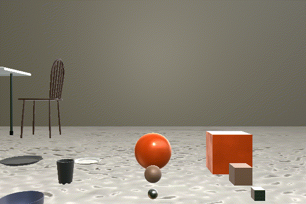
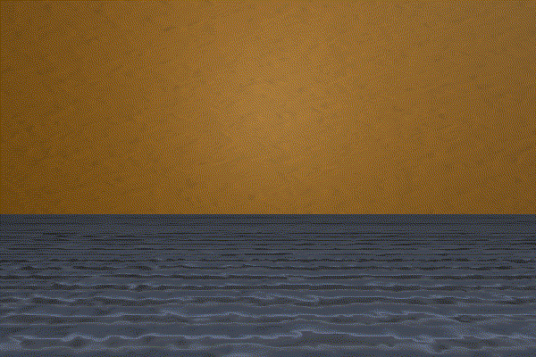
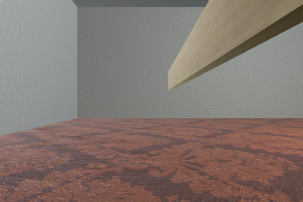
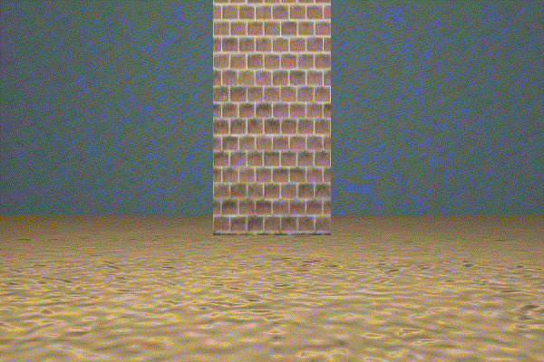

# MCS Scene Configuration Files: README

## Documentation

[API.md](./API.md)

## Examples

### Playroom

- [playroom.json](./playroom.json)

### IntPhys

- [intphys_gravity_plausible_sample_1.json](./intphys_gravity_plausible_sample_1.json)
- [intphys_gravity_implausible_sample_1.json](./intphys_gravity_implausible_sample_1.json)
- [intphys_object_permanence_plausible_sample_1.json](./intphys_object_permanence_plausible_sample_1.json)
- [intphys_object_permanence_implausible_sample_1.json](./intphys_object_permanence_implausible_sample_1.json)
- [intphys_shape_constancy_plausible_sample_1.json](./intphys_shape_constancy_plausible_sample_1.json)
- [intphys_shape_constancy_implausible_sample_1.json](./intphys_shape_constancy_implausible_sample_1.json)
- (Coming soon!) [intphys_spatial_temporal_continuity_plausible_sample_1.json](./intphys_spatial_temporal_continuity_plausible_sample_1.json)
- (Coming soon!) [intphys_spatial_temporal_continuity_implausible_sample_1.json](./intphys_spatial_temporal_continuity_implausible_sample_1.json)
- [intphys_energy_conservation_plausible_sample_1.json](./intphys_energy_conservation_plausible_sample_1.json)
- [intphys_energy_conservation_implausible_sample_1.json](./intphys_energy_conservation_implausible_sample_1.json)

#### Gravity

Plausible:

Implausible:

#### Object Permanence

Plausible:

Implausible:

#### Shape Constancy

Plausible:

Implausible:

#### Spatio-Temporal Continuity

Coming soon!

#### Energy Conservation

Plausible:

Implausible:

### Walls

- [wall_ahead.json](./wall_ahead.json)
- [wall_diagonal.json](./wall_diagonal.json)
- [wall_offset.json](./wall_offset.json)
- [wall_right.json](./wall_right.json)

